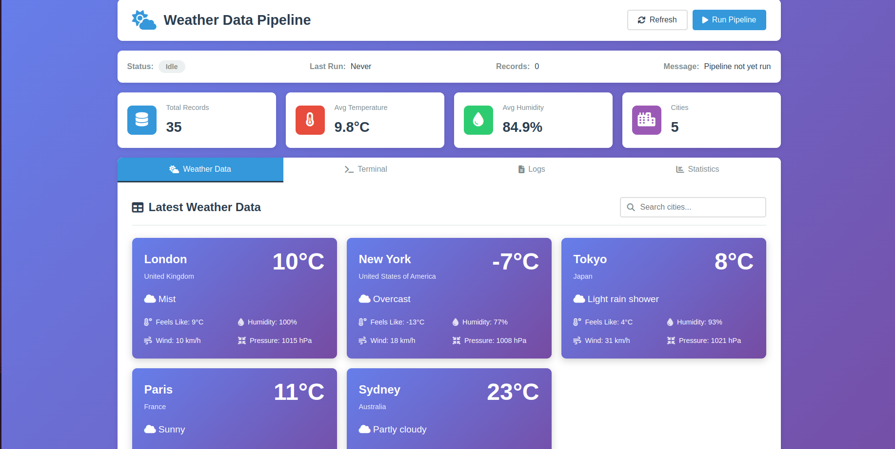

# Weather Data Pipeline

A Python ETL (Extract, Transform, Load) pipeline that collects weather data from RapidAPI and stores it in multiple formats.

## What It Does

- **Extracts** weather data from RapidAPI Weather API
- **Transforms** and cleans the data (temperature, humidity, wind, UV index, etc.)
- **Loads** data into CSV, SQLite, PostgreSQL, JSON, or Parquet formats
- Supports scheduling for automatic data collection

## Features

✅ Multiple cities weather collection  
✅ Real-time weather data (temperature, humidity, wind, UV, air quality)  
✅ Automated scheduling (hourly/custom intervals)  
✅ Multiple storage formats (CSV, SQLite, PostgreSQL, JSON, Parquet)  
✅ Data quality checks and cleaning  
✅ Comprehensive logging  

## Setup (5 Minutes)

### 1. Get RapidAPI Key (Free)

1. Sign up at [RapidAPI.com](https://rapidapi.com/)
2. Subscribe to [WeatherAPI](https://rapidapi.com/weatherapi/api/weatherapi-com/) (FREE tier: 1M requests/month)
3. Copy your API key

### 2. Install Dependencies

```bash
# Install pip (if needed)
curl -sS https://bootstrap.pypa.io/get-pip.py -o get-pip.py
python3 get-pip.py --user --break-system-packages
rm get-pip.py

# Install packages
~/.local/bin/pip3 install -r requirements.txt --user --break-system-packages
```

### 3. Configure

Create `.env` file:
```bash
cp .env.example .env
nano .env  # or use any text editor
```

Add your API key:
```env
RAPIDAPI_KEY=your_actual_api_key_here
RAPIDAPI_HOST=weatherapi-com.p.rapidapi.com
WEATHER_API_BASE_URL=https://weatherapi-com.p.rapidapi.com
CITIES=London,New York,Tokyo,Paris,Sydney
```

## How to Run

### 🌐 Web Dashboard (Recommended)



> **Note:** Make sure the image file is added to Git (`git add docs/Screenshot\ from\ 2026-02-25\ 16-01-59.png`) and pushed; otherwise the GitHub/Repo view can’t display it.
*Replace with actual screenshot if available.*

Start the interactive web dashboard:
```bash
python3 app.py
```
Then open http://localhost:5000 in your browser.

**Dashboard Features:**
- 📊 Real-time weather data visualization
- 🚀 One-click pipeline execution
- 📝 Live logs monitoring
- 📈 Statistics and analytics
- 💻 Built-in command terminal

### Collect Weather Data (One Time)
```bash
python3 pipeline.py
```

### View Collected Data
```bash
python3 view_data.py
```

### View Complete Analytical Data
```bash
python3 examples/analyze_data.py
```

**💡 Tip:** All these commands are also available in the web dashboard's **Terminal tab** with one-click execution and built-in output display!


Output example:
```
🌍 WEATHER DATA OVERVIEW
Total Records: 5
Cities: London, New York, Tokyo, Paris, Sydney

🌡️ TEMPERATURE STATISTICS
Average: 12.88°C
Min: -3.30°C (New York)
Max: 24.20°C (Sydney)

📍 CITY-BY-CITY WEATHER
London     | 16.3°C | Partly Cloudy | 63% humidity
New York   | -3.3°C | Sunny         | 55% humidity
Tokyo      | 12.2°C | Light rain    | 82% humidity
Paris      | 15.0°C | Partly cloudy | 72% humidity
Sydney     | 24.2°C | Clear         | 78% humidity
```

### Schedule Automatic Collection
```bash
python3 scheduler.py
```
Collects weather data every hour (customizable in `.env`)

### Run Examples
```bash
# Test components
python3 examples/test_components.py

# Detailed analysis
python3 examples/analyze_data.py

# Custom pipeline
python3 examples/custom_pipeline.py
```

## Quick Reference

| Command | Description |
|---------|-------------|
| `python3 app.py` | **Start web dashboard** ⭐ |
| `python3 pipeline.py` | Run pipeline once |
| `python3 view_data.py` | View collected data |
| `python3 scheduler.py` | Auto-collect every hour |
| `python3 examples/analyze_data.py` | Detailed analytics |
| `cat data/weather_data.csv` | View raw CSV data |
| `tail -f logs/*.log` | Check logs |

## Project Structure

```
DataPipeline/
├── pipeline.py              # Main pipeline
├── scheduler.py             # Automated scheduling
├── view_data.py             # Data viewer
├── .env                     # Your API configuration
├── config.yaml              # Pipeline settings
│
├── src/                     # Source code
│   ├── extract/             # API data extraction
│   ├── transform/           # Data cleaning
│   ├── load/                # Data storage
│   └── utils/               # Logging utilities
│
├── data/                    # Output data (CSV, DB)
├── logs/                    # Log files
├── backups/                 # Data backups
└── examples/                # Example scripts
```

## Data Collected

- **Location**: City, country, coordinates, timezone
- **Temperature**: Current, feels like, min, max
- **Conditions**: Weather description, cloudiness, visibility
- **Wind**: Speed, direction, gusts
- **Atmosphere**: Humidity, pressure, UV index
- **Air Quality**: PM2.5, CO levels
- **Timestamps**: Data collection time

## Configuration

### Change Cities
Edit `.env`:
```env
CITIES=Mumbai,Delhi,Bangalore,Chennai,Kolkata
```

### Change Storage Format
Edit `config.yaml`:
```yaml
storage:
  type: sqlite  # Options: csv, sqlite, postgresql, json, parquet
  sqlite_path: ./data/weather_data.db
```

### Change Update Frequency
Edit `.env`:
```env
FETCH_INTERVAL_MINUTES=30  # Update every 30 minutes
```

## Troubleshooting

**"No module named X"**
```bash
~/.local/bin/pip3 install -r requirements.txt --user --break-system-packages
```

**"Missing API key"**
- Make sure `.env` file exists
- Check `RAPIDAPI_KEY` is set correctly
- Verify you've subscribed to WeatherAPI on RapidAPI

**"403 Forbidden"**
- Check your RapidAPI subscription is active
- Verify `RAPIDAPI_HOST=weatherapi-com.p.rapidapi.com`

**View Logs**
```bash
tail -50 logs/weather_pipeline_*.log
```

## Requirements

- Python 3.8+
- RapidAPI account (free tier available)
- Internet connection

## Dependencies

- `requests` - HTTP API calls
- `pandas` - Data processing
- `python-dotenv` - Environment variables
- `sqlalchemy` - Database support
- `schedule` - Task scheduling
- `pyyaml` - Configuration

## Free Tier Limits

- **1,000,000 requests/month** on RapidAPI
- Perfect for collecting weather data for 10-20 cities every hour

## License

Open source - Free for educational and personal use

## Support

Check logs: `tail -f logs/*.log`  
View data: `python3 view_data.py`  
Test setup: `python3 examples/test_components.py`

## Deploying on Render

This project can run on [Render](https://render.com) using either a **web service** or the built‑in **cron / background worker** feature.

1. **Push your repository to GitHub** (already done).
2. Go to Render dashboard ➜ **New** ➜ **Web Service** (or **Background Worker/cron job**).
3. Connect the `sadhna29001/DataPipelineWithWeatherApi` repo.
4. Set the Environment to **Python 3** (ideally 3.11 or 3.13) and add a **build command**:
   ```bash
   pip install -r requirements.txt
   ```

   **Note:** Render’s default Python 3.14 may not yet have wheels for some
   packages (like pandas), causing build failures. Pinning the version to
   `3.11` in the Render dashboard or `render.yaml` avoids this issue.
5. For a web service use this start command:
   ```bash
   python3 pipeline.py
   ```
   or for continual scheduling choose **Background Worker** and use `python3 scheduler.py`.
6. (Optional) you can also enable a Render cron job by including the
   provided `render.yaml` at the root of your repo. An example definition
   is already in that file:
   ```yaml
   services:
     - type: web
       name: weather-pipeline-web
       env: python
       plan: free
       buildCommand: pip install -r requirements.txt
       startCommand: python3 pipeline.py
   # cron:
   #   - name: hourly-pipeline
   #     schedule: "0 * * * *"
   #     command: python3 pipeline.py
   ```

Render will automatically install dependencies and run your pipeline.  Use
either the web service or cron/worker depending on whether you need a
action on HTTP requests or simply periodic execution.  Logs are available
in the Render dashboard under your service’s **Logs** tab.

---

**Built with Python | Powered by RapidAPI WeatherAPI**
